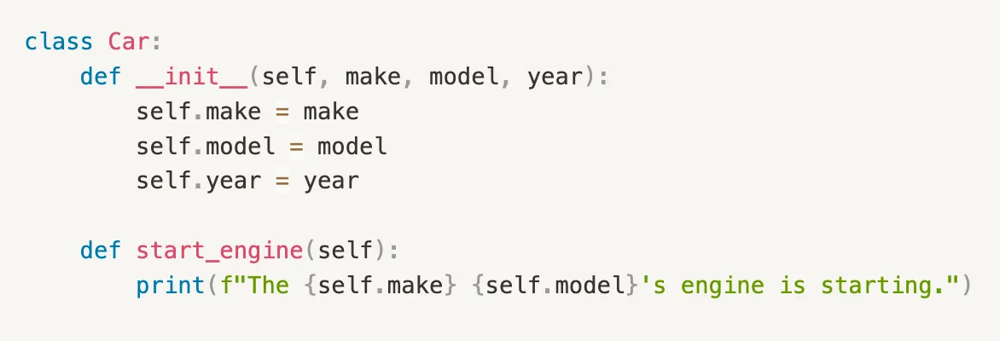
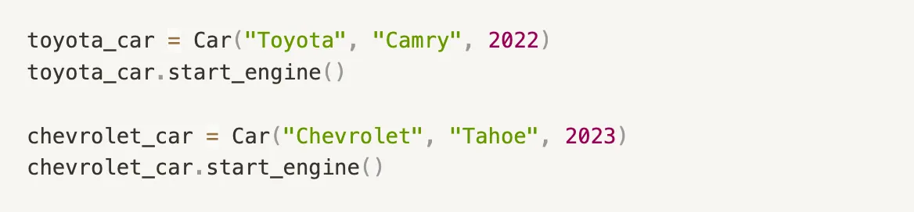

## 1. Classes and Objects

>	A class is a blueprint or template that defines the properties and behavior of an object. An Object is an instances of a class, created using the class definition.

Here's an example of a class definition in Python:

In this example, the Car class is a blueprint that defines the properties of a car.

We create two objects, toyota_car and chevrolet_car which are instances of the Car class. Both car objects can invoke start_engine() method using their own values for the make, model and year properties.
